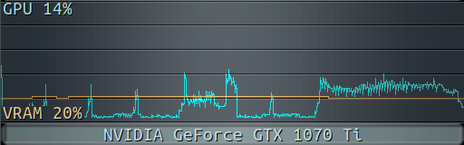

# GKrellM NVIDIA GPU Plugin

A GKrellM 2.x plugin that adds nvtop-style GPU and VRAM monitoring for NVIDIA cards using the NVIDIA Management Library (NVML).

## Highlights
- Dual-line chart tracking GPU utilisation and VRAM usage on the same scale.
- Configurable text overlay with default format `\\D2$V\\D0\\t\\f$G` (labelled GPU and VRAM readouts).
- Panel layer integrates with GKrellM theming and remembers preferences between sessions.
- Lightweight C implementation with zero runtime dependencies beyond GKrellM, GTK+ 2.0 and NVML.



## Quick Start
1. Ensure the proprietary NVIDIA driver is installed (`nvidia-smi` must succeed) and GKrellM development headers are available.
2. Clone this repository and build the plugin:
   ```bash
   make
   make install   # installs to ~/.gkrellm2/plugins by default
   ```
3. Restart GKrellM — the GPU monitor appears above the CPU monitor. Use `Configuration → Builtins → GPU` to toggle visibility or update settings.

More detailed setup notes live in `docs/installation.md` and `docs/configuration.md`.

## Project Layout
- `src/` — plugin source code (`gkrellm-gpu.c`).
- `build/` — compilation output (ignored in git).
- `docs/` — supplementary guides for users and developers.
- `assets/` — screenshots and media used in documentation.
- `scripts/` — helper utilities for packaging or maintenance.

## Development
- Build locally with `make` (uses `pkg-config` to locate GTK+ 2.0).
- Run `make clean` to remove artefacts.
- Coding style follows GKrellM conventions; see `CONTRIBUTING.md` for patch workflow and guidelines.
- Changes are tracked in `CHANGELOG.md`. Tag releases using semantic versioning (e.g. `v0.1.0`).

## Troubleshooting
- **NVML unavailable**: install the NVIDIA proprietary driver package that ships `libnvidia-ml.so`. On Debian-based systems this is `libnvidia-ml-dev`.
- **GKrellM not loading plugin**: confirm the `.so` lives in `~/.gkrellm2/plugins/` and that GKrellM has read permissions.
- **Multiple GPUs**: the current implementation monitors the first detected device (`GPU 0`). Additions are welcome via pull requests.

See `LICENSE` for terms. Contributions are welcome!
